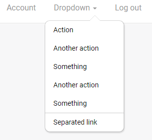
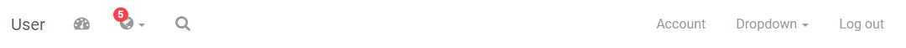
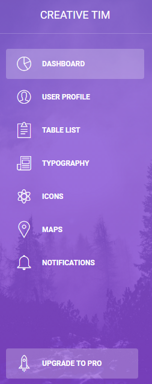
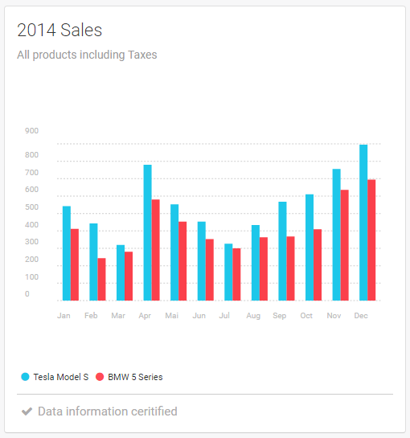

## Short summary

Besides giving the existing Bootstrap elements a new look, we added new ones, so that the interface is consistent and homogenous.

## Buttons

### Colors

We worked over the original Bootstrap classes, choosing a different, slightly intense color pallete:

<button class="btn btn-default btn-fill">Default</button>

<button class="btn btn-primary btn-fill">Primary</button>

<button class="btn btn-info btn-fill">Info</button>

<button class="btn btn-success btn-fill">Success</button>

<button class="btn btn-warning btn-fill">Warning</button>

<button class="btn btn-danger btn-fill">Danger</button>

```html
<button class="btn btn-default btn-fill">Default</button>

<button class="btn btn-primary btn-fill">Primary</button>

<button class="btn btn-info btn-fill">Info</button>

<button class="btn btn-success btn-fill">Success</button>

<button class="btn btn-warning btn-fill">Warning</button>

<button class="btn btn-danger btn-fill">Danger</button>
```

### Sizes

Buttons come in all needed sizes:

<button class="btn btn-lg btn-fill">Large</button>

<button class="btn btn-fill">Default</button>

<button class="btn btn-sm btn-fill">Small</button>

<button class="btn btn-xs btn-fill">X-Small</button>

<br>

<button class="btn btn-round btn-lg btn-fill">Large</button>

<button class="btn btn-round btn-fill">Default</button>

<button class="btn btn-round btn-sm btn-fill">Small</button>

<button class="btn btn-round btn-xs btn-fill">X-Small</button>

```html
<button class="btn btn-lg btn-fill">Large</button>

<button class="btn btn-fill">Default</button>

<button class="btn btn-sm btn-fill">Small</button>

<button class="btn btn-xs btn-fill">X-Small</button>

<br>

<button class="btn btn-round btn-lg btn-fill">Large</button>

<button class="btn btn-round btn-fill">Default</button>

<button class="btn btn-round btn-sm btn-fill">Small</button>

<button class="btn btn-round btn-xs btn-fill">X-Small</button>
```

### Styles

We added extra classes that can help you better customise the look. You can use regular buttons, filled buttons, rounded corners buttons or plain link buttons. Let's see some examples:

<button class="btn btn-wd">Default</button>

<button class="btn btn-fill btn-wd">Fill</button>

<button class="btn btn-fill btn-round btn-wd">Fill + Round </button>

<button class="btn btn-round btn-wd">Round</button>

<button class="btn btn-simple btn-wd">Simple</button>


```html

<button class="btn btn-wd">Default</button>

<button class="btn btn-fill btn-wd">Fill</button>

<button class="btn btn-fill btn-round btn-wd">Fill + Round </button>

<button class="btn btn-round btn-wd">Round</button>

<button class="btn btn-simple btn-wd">Simple</button>

```
### Buttons with label

<button class="btn btn-wd btn-success">
	<span class="btn-label">
		<i class="fa fa-check"></i>
	</span>
	Success
</button>

<button class="btn btn-wd btn-danger">
	<span class="btn-label">
		<i class="fa fa-times">
		</i>
		Danger
	</span>
</button>

<button class="btn btn-wd btn-info">
	<span class="btn-label">
		<i class="fa fa-exclamation">
		</i>
		Info
	</span>
</button>

<button class="btn btn-wd btn-warning">
	<span class="btn-label">
		<i class="fa fa-warning">
		</i>
		Warning
	</span>
</button>

<button class="btn btn-wd btn-default">
	<span class="btn-label">
		<i class="fa fa-arrow-left">
		</i>
		Left
	</span>
</button>

<button class="btn btn-wd btn-default">
	<span class="btn-label">
		<i class="fa fa-arrow-right">
		</i>
		Right
	</span>
</button>

```html

<button class="btn btn-wd btn-success">
	<span class="btn-label">
		<i class="fa fa-check"></i>
	</span>
	Success
</button>

<button class="btn btn-wd btn-danger">
	<span class="btn-label">
		<i class="fa fa-times">
		</i>
		Danger
	</span>
</button>

<button class="btn btn-wd btn-info">
	<span class="btn-label">
		<i class="fa fa-exclamation">
		</i>
		Info
	</span>
</button>

<button class="btn btn-wd btn-warning">
	<span class="btn-label">
		<i class="fa fa-warning">
		</i>
		Warning
	</span>
</button>

<button class="btn btn-wd btn-default">
	<span class="btn-label">
		<i class="fa fa-arrow-left">
		</i>
		Left
	</span>
</button>

<button class="btn btn-wd btn-default">
	<span class="btn-label">
		<i class="fa fa-arrow-right">
		</i>
		Right
	</span>
</button>

```
### Button Group

<div class="btn-group">
	<button type="button" class="btn btn-default">Left</button>
	<button type="button" class="btn btn-default">Middle</button>
	<button type="button" class="btn btn-default">Right</button>
</div>
<br>
<br>
<div class="btn-group">
	<button type="button" class="btn btn-default">1</button>
	<button type="button" class="btn btn-default">2</button>
	<button type="button" class="btn btn-default">3</button>
	<button type="button" class="btn btn-default">4</button>
</div>

<div class="btn-group">
	<button type="button" class="btn btn-default">5</button>
	<button type="button" class="btn btn-default">6</button>
	<button type="button" class="btn btn-default">7</button>
</div>

<div class="btn-group">
	<button type="button" class="btn btn-default">8</button>
</div>

```html
<div class="btn-group">
	<button type="button" class="btn btn-default">Left</button>
	<button type="button" class="btn btn-default">Middle</button>
	<button type="button" class="btn btn-default">Right</button>
</div>
<br>
<br>
<div class="btn-group">
	<button type="button" class="btn btn-default">1</button>
	<button type="button" class="btn btn-default">2</button>
	<button type="button" class="btn btn-default">3</button>
	<button type="button" class="btn btn-default">4</button>
</div>

<div class="btn-group">
	<button type="button" class="btn btn-default">5</button>
	<button type="button" class="btn btn-default">6</button>
	<button type="button" class="btn btn-default">7</button>
</div>

<div class="btn-group">
	<button type="button" class="btn btn-default">8</button>
</div>
```


## Dropdown

We are very proud to present the dropdown, we added a subtle animation for this classic widget. 

Here are an example and the code:



```html
<li class="dropdown nav-item">
	<a href="#" class="dropdown-toggle nav-link" data-toggle="dropdown">
		<p>
			Dropdown
			<b class="caret"></b>
		</p>
	</a>
	<ul class="dropdown-menu">
		<li><a href="#">Action</a></li>
	    <li><a href="#">Another action</a></li>
	    <li><a href="#">Something</a></li>
	    <li><a href="#">Another action</a></li>
	    <li><a href="#">Something</a></li>
	    <li class="divider"></li>
	    <li><a href="#">Separated link</a></li>
	</ul>
</li>
```

## Inputs

We restyled the Bootstrap input to give it a more flat, minimal look. You can use the classic look and different colors.


<div class="form-group">

    <input type="text" placeholder="Input" class="form-control" />

</div>

<div class="form-group has-success">

    <input type="text" value="Success" class="form-control" />

</div>

<div class="form-group has-error ">

    <input type="text" value="Error" class="form-control" />

</div>

```html
<div class="form-group">

    <input type="text" placeholder="Input" class="form-control" />

</div>

<div class="form-group has-success">

    <input type="text" value="Success" class="form-control" />

</div>

<div class="form-group has-error ">

    <input type="text" value="Error" class="form-control" />

</div>
```

## Notifications

The new Light Bootstrap Dashboard notification are looking fresh and clean. They go great with the navbar. They come with 4 classes, each for a different color: '.alert-info', '.alert-success', '.alert-warning', 'alert-danger'. 

If you want to use add special animations for them, we integrated a third party plugin called Bootstrap Notify. To see the original repository for it, check it out here. Out friend Robert McIntosh did a wonderful job. If you want to see a coded example, you can see it below.


```html
<!-- button to trigger the action -->
<button class="btn btn-default" onclick="showNotification('top','right')">Top Right Notification</button>

<!-- javascript -->
function showNotification(from, align){
	color = Math.floor((Math.random() * 4) + 1);

	$.notify({
    	icon: "pe-7s-gift",
    	message: "Welcome to <b>Light Bootstrap Dashboard</b> - a beautiful freebie for every web developer."

    },{
        type: type[color],
        timer: 4000,
        placement: {
            from: from,
            align: align
        }
    });
}
```

## Navbar

We restyled the classic Bootstrap Navbar:



```html
<nav class="navbar navbar-expand-md">
	 <button class="navbar-toggler d-sm-block d-lg-none" type="button" data-toggle="collapse"  aria-expanded="false" aria-label="Toggle navigation">
	   	<i class="fa fa-bars"></i>
	  </button>
	  <div class="collapse navbar-collapse">
	  	<ul class="nav navbar-nav navbar-left">
	  		<div class="input-group">
	  			<div class="input-group-addon"><i class="fa fa-search"></i></div>
				<input type="text" class="form-control" id="inlineFormInputGroup" placeholder="Search anything you want">
	  		</div>
	  	</ul>
	  	<ul class="navbar-nav ml-auto">
	  		<li class="nav-item dropdown">
	  			<a href="#" class="nav-link dropdown-toggle" data-toggle="dropdown">
		  			<div class="notification d-none d-lg-block d-xl-block"></div>
	  				<i class="nc-icon nc-notification-70"></i>
	  				<b class="caret d-none d-lg-block d-xl-block"></b>
		  			<p class="d-lg-none">
						New Notifications
						<b class="caret"></b>
					</p>
	  			</a>
	  			<ul class="dropdown-menu">
	  				<li><a href="#"  class="dropdown-item">Notification 1</a></li>
	                <li><a href="#" class="dropdown-item">Notification 2</a></li>
	                <li><a href="#" class="dropdown-item">Notification 3</a></li>
	                <li><a href="#" class="dropdown-item">Notification 4</a></li>
	                <li><a href="#" class="dropdown-item">Another Notification</a></li>
	  			</ul>
	  		</li>
	  		<li class="nav-item">
	  			<a href="#" class="nav-link">
	  				<i class="nc-icon nc-map-big"></i>	
	  				<p class="d-lg-none">Contacts</p>	
	  			</a>
	  		</li>
	  		<li class="nav-item">
	  			<a href="#" class="nav-link">
	  				<i class="nc-icon nc-bell-55"></i>
	  				<p class="d-lg-none">Messages</p>
	  			</a>
	  		</li>
	  		<li class="dropdown nav-item">
	  			<a href="#" class="dropdown-toggle nav-link" data-toggle="dropdown">
					<i class="nc-icon nc-circle-08"></i>
					<b class="caret d-none d-lg-block d-xl-block"></b>
					<p class="d-lg-none">
						Log out
						<b class="caret"></b>
					</p>
	  			</a>
	  			<ul class="dropdown-menu menu-2">
	  				<li><a href="#">Action</a></li>
	                <li><a href="#">Another action</a></li>
	                <li><a href="#">Something</a></li>
	                <li><a href="#">Another action</a></li>
	                <li><a href="#">Something</a></li>
	                <li class="divider"></li>
	                <li><a href="#">Separated link</a></li>
	  			</ul>
	  		</li>
	  		<li class="separator d-lg-none"></li>
	  	</ul><!--navbar right-->
	</div>  
</nav>
```

## Sidebar 

We have created the class ".sidebar" for navigation. It contains the company title and a list of all the pages.



```html
<div class="sidebar">
	<div class="sidebar-wrapper">
		<div class="logo">
			<a href="#">
				Hermes
			</a>
		</div><!--logo-->
		<ul class="nav">
			<li class="nav-item">
				<a href="dashboard.html" class="nav-link nav-link-blue active">
					<i class="nc-icon nc-bullet-list-67"></i>
					<p>Dashboard</p>
				</a>
			</li>
			<li class="nav-item">
				<a href="user.html" class="nav-link nav-link-light-blue">
					<i class="nc-icon nc-badge"></i>
					<p>User Profile</p>
				</a>
			</li>
			<li class="nav-item">
				<a href="table.html" class="nav-link nav-link-pink">
					<i class="nc-icon nc-calendar-grid-58"></i>
					<p>Table List</p>
				</a>
			</li>
			<li class="nav-item">
				<a href="typography.html" class="nav-link nav-link-orange">
					<i class="nc-icon nc-book-bookmark"></i>
					<p>Typography</p>
				</a>
			</li>
			<li class="nav-item">
				<a href="icons.html" class="nav-link nav-link-purple">
					<i class="nc-icon nc-palette"></i>
					<p>Icons</p>
				</a>
			</li>
				<li class="nav-item">
				<a href="maps.html" class="nav-link nav-link-red">
					<div class="i">
					<i class="nc-icon nc-pin-3"></i>
					</div>
					<p>Maps</p>
				</a>
			</li>
			<li class="nav-item">
				<a href="notifications.html" class="nav-link nav-link-green">
					<i class="nc-icon nc-bell-55"></i>
					<p>Notifications</p>
				</a>
			</li>
			<li class="nav-item">
				<a href="Components.html" class="nav-link nav-link-dark-red">
					<i class="nc-icon nc-chart-pie-35"></i>
					<p>Components</p>
				</a>
			</li>
			<li class="nav-item">
				<a href="cards.html" class="nav-link nav-link-light-purple">
					<i class="nc-icon nc-credit-card"></i>
					<p>Cards</p>
				</a>
			</li>
		</ul>
	</div><!--sidebar-wrapper-->
</div><!--sidebar-->

```

## Card

Cards are composed of header and content.



```html
<div class="card">
	<div class="header">
		<h4 class="title float-left text-green">GROSS VOLUME</h4>
		<p class="category float-right text-blue">$3470.00 USD TOTAL</p>
	</div><!--header-->
	<div class="content tab-content">
		<div id="chartPreferences1" class="ct-chart tab-pane active" role="tabpanel"></div>
		<div id="chartPreferences2" class="ct-chart tab-pane" role="tabpanel"></div>
		<div id="chartPreferences3" class="ct-chart tab-pane" role="tabpanel"></div>
	</div><!--content-->
</div><!--card-->
```

## Charts

For the implementation of graphic charts, we used the Chartist plugin and added our custom styles. The plugin is free to download and use here. Gion Kunz is the guy behind the project; he did an awesome job and we recommend using it his stuff. Besides all the great customisation that you have using it, it is also fully responsive. We changed the colors, background and typography.


#### Line Chart

We recommend using this chart when you have easy to understand information, that can be conveyed in a single line throughout a continuous period.


```html
<div class="card">
	<div class="header">
		<h4 class="title float-left text-green">SUCCESSFUL CHARGES</h4>
		<p class="category float-right text-blue">$34 USD TOTAL</p>
	</div><!--header-->
	<div class="content">
		<div id="chartCharges"></div>
	</div><!--content-->
</div><!--card-->

<!--javascript-->
var data_charges =  {
        series: [
            [7,9,7.3,7.7,8.6,10,9.1,8.9,9,8.6,7.3,7.8,8.2]
          ]
        };
      var options2 = {
        lineSmooth: Chartist.Interpolation.simple({
                divisor: 100
              }),
              showArea: false,
              showPoint: true,
              low: 6,
              high:11,
              showLine: true,
              height: '150px',
              axisX: {
                showGrid: false
              }
    };
      

    var chart_charges = new Chartist.Line('#chartCharges', data_charges, options2);
```