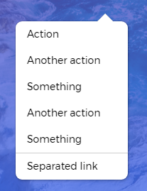
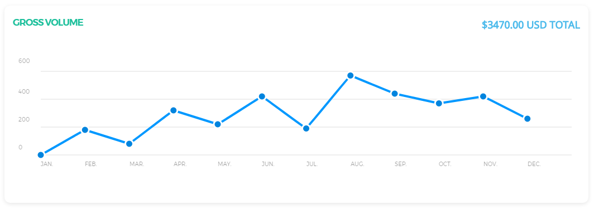
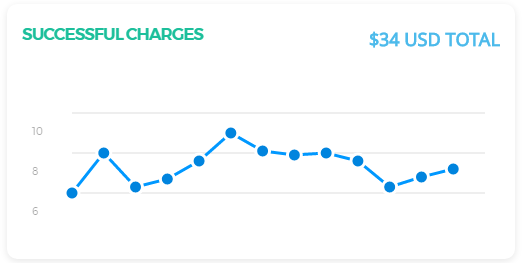

## Short summary

Besides giving the existing Bootstrap elements a new look, we added new ones, so that the interface is consistent and homogenous.

## Buttons

### Colors

We worked over the original Bootstrap classes, choosing a different, slightly intense color pallete:

<button class="btn btn-default">Default</button>


<button class="btn btn-default">Default</button>

```html
<button class="btn btn-default">Default</button>

<button class="btn btn-primary">Primary</button>

<button class="btn btn-info">Info</button>

<button class="btn btn-success">Success</button>

<button class="btn btn-warning">Warning</button>

<button class="btn btn-danger">Danger</button>
```

### Sizes

Buttons come in all needed sizes:


```html
<button class="btn btn-primary btn-lg">Large</button>

<button class="btn btn-primary">Normal</button>

<button class="btn btn-primary btn-sm">Small</button>

<button class="btn btn-primary btn-xs">Extra Small</button>
```

### Styles

We added extra classes that can help you better customise the look. You can use regular buttons, filled buttons, rounded corners buttons or plain link buttons. Let's see some examples:


```html
<button class="btn btn-primary">Default</button>

<button class="btn btn-primary btn-fill">Filled</button>

<button class="btn btn-primary btn-round">Round</button>

<button class="btn btn-primary btn-simple">Simple</button>
```

## Checkboxes

We created customed checkboxes:


```html
<label class="checkbox">
	<input type="checkbox">
	<span class="checkbox_icon"></span>
</label>

<label class="checkbox">
	<input type="checkbox" checked>
	<span class="checkbox_icon"></span>
</label>
```

## Dropdown

We are very proud to present the dropdown, we added a subtle animation for this classic widget. 

Here are an example and the code:



```html
<li class="dropdown nav-item">
	<a href="#" class="dropdown-toggle nav-link" data-toggle="dropdown">
		<p>
			Dropdown
			<b class="caret"></b>
		</p>
	</a>
	<ul class="dropdown-menu menu-2">
		<li><a href="#">Action</a></li>
	    <li><a href="#">Another action</a></li>
	    <li><a href="#">Something</a></li>
	    <li><a href="#">Another action</a></li>
	    <li><a href="#">Something</a></li>
	    <li class="divider"></li>
	    <li><a href="#">Separated link</a></li>
	</ul>
</li>
```

## Inputs

We restyled the Bootstrap input to give it a more flat, minimal look. You can use the classic look and different colors.


```html
<div class="form-group">

    <input type="text" placeholder="Input" class="form-control" />

</div>


<div class="form-group has-success">

    <input type="text" value="Success" class="form-control" />

</div>


<div class="form-group has-error ">

    <input type="text" value="Error" class="form-control" />

</div>
```

## Notifications

The new Light Bootstrap Dashboard notification are looking fresh and clean. They go great with the navbar. They come with 4 classes, each for a different color: '.alert-info', '.alert-success', '.alert-warning', 'alert-danger'. 

If you want to use add special animations for them, we integrated a third party plugin called Bootstrap Notify. To see the original repository for it, check it out here. Out friend Robert McIntosh did a wonderful job. If you want to see a coded example, you can see it below.


```html
<!-- button to trigger the action -->
<button class="btn btn-default" onclick="showNotification('top','right')">Top Right Notification</button>

<!-- javascript -->
function showNotification(from, align){
	color = Math.floor((Math.random() * 4) + 1);

	$.notify({
    	icon: "pe-7s-gift",
    	message: "Welcome to <b>Light Bootstrap Dashboard</b> - a beautiful freebie for every web developer."

    },{
        type: type[color],
        timer: 4000,
        placement: {
            from: from,
            align: align
        }
    });
}
```

## Navbar

We restyled the classic Bootstrap Navbar:


```html
<nav class="navbar navbar-toggleable-md">
	<div class="navbar-header">
	  <button class="navbar-toggler navbar-toggler-right" type="button" data-toggle="collapse" data-target="#navbar1">
	   	<i class="fa fa-bars"></i>
	  </button>
	  <a class="navbar-brand" href="#">Dashboard</a>
  	</div>
  	<div class="collapse navbar-collapse" id="navbar1">
	  	<ul class=" nav navbar-nav navbar-left">
	  		<li class="nav-item">
	  			<a href="#" data-toggle="dropdown"
	  			class="nav-link">
	  				<i class="fa fa-tachometer" aria-hidden="true"></i>
	  				<p class="hidden-lg-up">Dashboard</p>
	  			</a>
	  		</li>
	  		<li class="dropdown nav-item">
	  			<a href="#" class="dropdown-toggle nav-link" data-toggle="dropdown">
	  				<i class="fa fa-globe"></i>
                    <b class="caret hidden-sm hidden-xs"></b>
                    <span class="notification hidden-sm hidden-xs">5</span>
					<p class="hidden-md-up">
						5 Notifications
						<b class="caret"></b>
					</p>
	  			</a>
	  			<ul class="dropdown-menu" >
	  				 <li><a href="#">Notification 1</a></li>
                    <li><a href="#">Notification 2</a></li>
                    <li><a href="#">Notification 3</a></li>
                    <li><a href="#">Notification 4</a></li>
                    <li><a href="#" style="font-size: 14px;">Another notification</a></li>
	  			</ul>
	  		</li>
	  		<li class="nav-item">
	  			<a class="nav-link" href="#">
	  				<i class="fa fa-search"></i>
	  				<p class="hidden-lg-up">Search</p>
	  			</a>
	  		</li>
	  	</ul><!--navbar left-->
	  	<ul class="navbar-nav ml-auto">
	  		<li class="nav-item">
	  			<a href="#" class="nav-link">
	  				<p>Account</p>
	  			</a>
	  		</li>
	  		<li class="dropdown nav-item">
	  			<a href="#" class="dropdown-toggle nav-link" data-toggle="dropdown">
	  				<p>
	  					Dropdown
	  					<b class="caret"></b>
	  				</p>
	  			</a>
	  			<ul class="dropdown-menu menu-2">
	  				<li><a href="#">Action</a></li>
                    <li><a href="#">Another action</a></li>
                    <li><a href="#">Something</a></li>
                    <li><a href="#">Another action</a></li>
                    <li><a href="#">Something</a></li>
                    <li class="divider"></li>
                    <li><a href="#">Separated link</a></li>
	  			</ul>
	  		</li>
	  		<li class="nav-item">
	  			<a href="#" class="nav-link">
	  				<p>Log out</p>
	  			</a>
	  		</li>
	  		<li class="separator hidden-sm-up"></li>
	  	</ul><!--navbar right-->
  	</div>  
</nav>
```

## Sidebar 

We have created the class ".sidebar" for navigation. It contains the company title and a list of all the pages.

If you want the sidebar to have the background as a solid color, you can use the 'data-color' attribute and add the color you like: data-color="blue | azure | green | orange | red | purple ". If you want the background to have a picture, you ca activate it like this: data-image="img/sidebar-background.jpg".
You can see the fully-coded example for the sidebar inside the dashboard below, which has a background image and the color purple. 


```html
<div class="sidebar" data-color="purple" data-image="img/sidebar-background.jpg">
	<div class="sidebar-wrapper">
		<div class="logo">
			<a href="http://www.creative-tim.com">
				Hermes
			</a>
		</div><!--logo-->
		<ul class="nav">
			<li class="nav-item active">
				<a href="dashboard.html" class="nav-link">
					<i class="pe-7s-graph"></i>
					<p>Dashboard</p>
				</a>
			</li>
			<li class="nav-item">
				<a href="user.html" class="nav-link">
					<i class="pe-7s-user"></i>
					<p>User Profile</p>
				</a>
			</li>
			<li class="nav-item">
				<a href="table.html" class="nav-link">
					<i class="pe-7s-note2"></i>
					<p>Table List</p>
				</a>
			</li>
			<li class="nav-item">
				<a href="typography.html" class="nav-link">
					<i class="pe-7s-news-paper"></i>
					<p>Typography</p>
				</a>
			</li>
			<li class="nav-item">
				<a href="icons.html" class="nav-link">
					<i class="pe-7s-science"></i>
					<p>Icons</p>
				</a>
			</li>
				<li class="nav-item">
				<a href="maps.html" class="nav-link">
					<i class="pe-7s-map-marker"></i>
					<p>Maps</p>
				</a>
			</li>
			<li class="nav-item">
				<a href="notifications.html" class="nav-link">
					<i class="pe-7s-bell"></i>
					<p>Notifications</p>
				</a>
			</li>
			<li class="upgrade active nav-item">
				<a href="#" class="nav-link">
					<i class="pe-7s-rocket"></i>
					<p>Upgrade to pro</p>
				</a>
			</li>
		</ul>
	</div><!--sidebar-wrapper-->
</div><!--sidebar-->

```

## Card

Cards are composed of header and content with a footer.



```html
<div class="card">
	<div class="header">
		<h4 class="title">2014 Sales</h4>
		<p class="category">All products including Taxes</p>
	</div><!--header-->
	<div class="content">
		<div id="chartActivity" class="ct-chart"></div>
		<div class="footer">
			<div class="legend">
			<i class="fa fa-circle text-info"></i><span>Tesla Model S</span>
			<i class="fa fa-circle text-danger"></i><span>BMW 5 Series</span>
			</div>
			<div class="stats">
				<i class="fa fa-check"></i>Data information ceritified
			</div>
		</div><!--footer-->
	</div><!--content-->
</div><!--card-->
```

## Charts

For the implementation of graphic charts, we used the Chartist plugin and added our custom styles. The plugin is free to download and use here. Gion Kunz is the guy behind the project; he did an awesome job and we recommend using it his stuff. Besides all the great customisation that you have using it, it is also fully responsive. We changed the colors, background and typography.

#### Pie Chart

A pie chart is the easiest way to represent an information. Use it whenever you want to show something understandable at once.


```html
<div class="card">
	<div class="header">
		<h4 class="title">Email Statistics</h4>
		<p class="category">Last Campaign Performance</p>
	</div><!--header-->
	<div class="content">
		<div id="chartPreferences" class="ct-chart ct-negative-labels"></div>
		<div class="footer">
			<div class="legend">
				<i class="fa fa-circle text-info"></i><span>Open</span>
	            <i class="fa fa-circle text-danger"></i><span>Bounce</span>
	            <i class="fa fa-circle text-warning"></i><span>Unsubscribe</span>
			</div>
			<div class="stats">
				<i class="fa fa-clock-o"></i>Campaign sent 2 days ago
			</div>
		</div><!--footer-->
	</div><!--content-->
</div><!--card-->

<!-- javascript -->

Chartist.Pie('#chartPreferences', {

  labels: ['46%','28%','15%','11%'],

  series: [46, 28, 15, 11]

});
```

#### Multiple Bars Chart

Go for multiple bars charts if you want to show two indicators side by side.


```html
<div class="card">
	<div class="header">
		<h4 class="title">2014 Sales</h4>
		<p class="category">All products including Taxes</p>
	</div><!--header-->
	<div class="content">
		<div id="chartActivity" class="ct-chart"></div>
		<div class="footer">
			<div class="legend">
			<i class="fa fa-circle text-info"></i><span>Tesla Model S</span>
			<i class="fa fa-circle text-danger"></i><span>BMW 5 Series</span>
			</div>
			<div class="stats">
				<i class="fa fa-check"></i>Data information ceritified
			</div>
		</div><!--footer-->
	</div><!--content-->
</div><!--card-->


<!-- javascript -->

var data = {

  labels: ['Jan', 'Feb', 'Mar', 'Apr', 'Mai', 'Jun', 'Jul', 'Aug', 'Sep', 'Oct', 'Nov', 'Dec'],

  series: [

    [542, 443, 320, 780, 553, 453, 326, 434, 568, 610, 756, 895],

    [412, 243, 280, 580, 453, 353, 300, 364, 368, 410, 636, 695]

  ]

};


var options = {

  seriesBarDistance: 10,

   axisX: {

        showGrid: false

    }

};


var responsiveOptions = [

  ['screen and (max-width: 640px)', {

    seriesBarDistance: 5,

    axisX: {

      labelInterpolationFnc: function (value) {

        return value[0];

      }

    }

  }]

];


Chartist.Bar('#chartActivity', data, options, responsiveOptions);
```

#### Line Chart

We recommend using this chart when you have easy to understand information, that can be conveyed in a single line throughout a continuous period.



```html
<div class="card">
	<div class="header">
		<h4 class="title">Users Behavior</h4>
		<p class="category">24 hours performance</p>
	</div><!--header-->
	<div class="content">
		<div id="chartHours"></div>
		<div class="footer">
			<div class="legend">
			<i class="fa fa-circle text-info"></i><span>Open</span>
     		<i class="fa fa-circle text-danger"></i><span>Click</span>
     		<i class="fa fa-circle text-warning"></i><span>Click Second Time</span>
			</div>
			<div class="stats">
				<i class="fa fa-upload"></i>Updated 3 minutes ago
			</div>
		</div><!--footer-->
	</div><!--content-->
</div><!--card-->

<!--javascript-->

var dataSales = {
          labels: ['9:00AM', '12:00AM', '3:00PM', '6:00PM', '9:00PM', '12:00PM', '3:00AM', '6:00AM'],
          series: [
             [287, 385, 490, 492, 554, 586, 698, 695, 752, 788, 846, 944],
            [67, 152, 143, 240, 287, 335, 435, 437, 539, 542, 544, 647],
            [23, 113, 67, 108, 190, 239, 307, 308, 439, 410, 410, 509]
          ]
        };
        
        var optionsSales = {
          lineSmooth: false,
          low: 0,
          high: 800,
          showArea: true,
          height: "245px",
          axisX: {
            showGrid: false,
          },
          lineSmooth: Chartist.Interpolation.simple({
            divisor: 3
          }),
          showLine: false,
          showPoint: false,
        };
        
        var responsiveSales = [
          ['screen and (max-width: 640px)', {
            axisX: {
              labelInterpolationFnc: function (value) {
                return value[0];
              }
            }
          }]
        ];
    
        Chartist.Line('#chartHours', dataSales, optionsSales, responsiveSales);
```